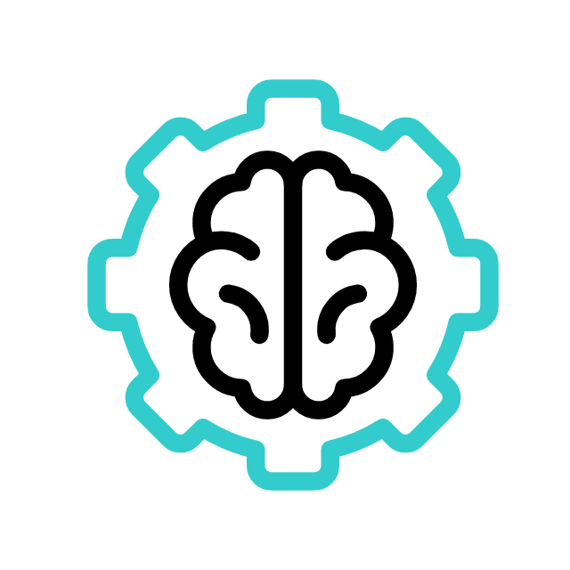
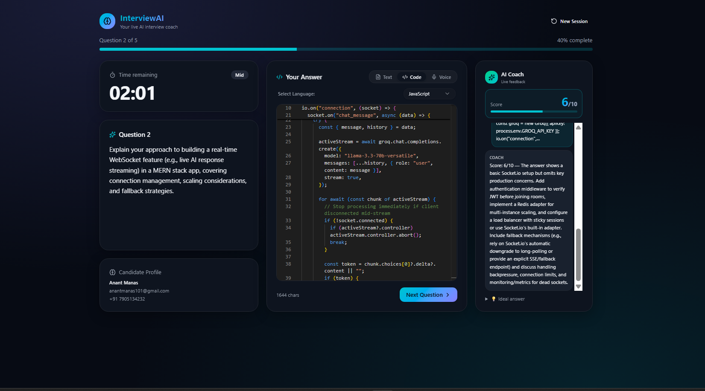
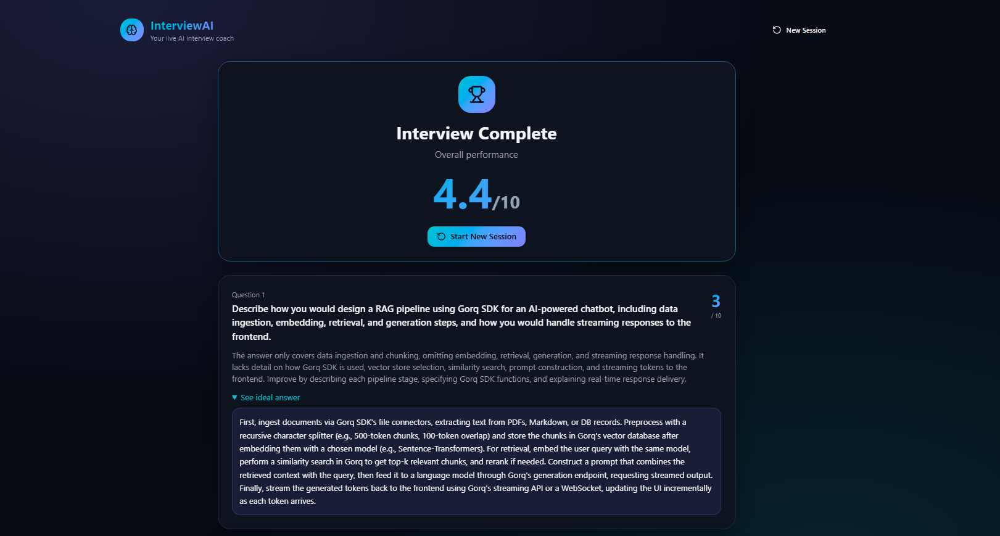
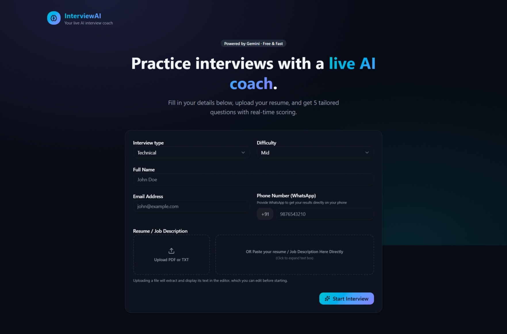

  
  <h1>InterviewAI</h1>
  
<strong>Your intelligent, live AI interview coach. Practice technical, behavioral, and system design interviews in real-time.</strong>

  <a href="https://ai-prep-saas-pied.vercel.app/"><strong>Explore Live Demo »</strong></a>

 

---

## 🌟 Overview

**InterviewAI** is a premium, bento-style AI interview simulator designed to give candidate preparation the edge. By tailoring high-quality questions to your resume context and job description, it mirrors a realistic, professional interviewing environment. Receive instant ratings, constructive evaluations, and ideal answer walkthroughs from an interactive AI Coach.

---

## 🚀 Key Features

*   **🎯 Resume-Tailored Scenarios:** Upload your resume (PDF/TXT) or paste your target job description. The AI analyzes your background and generates 5 highly customized, role-specific questions matching your target difficulty.
*   **💻 Integrated Monaco Code Editor:** Write syntax-highlighted code inside a professional-grade editor with multi-language support (JavaScript, TypeScript, Python, Java, C++, Go, Rust, and more).
*   **🎙️ Real-time Voice Dictation:** Speak your responses naturally. Built-in **Web Speech API** dictation transcribes your answers on-the-fly.
*   **📊 Dynamic AI Coaching & Scoring:** Get immediate, expert evaluation (score out of 10) with detailed sentences highlighting strengths, actionable improvement points, and a gold-standard "ideal answer" reference.
*   **🏆 Performance Report Dashboard:** Receive a comprehensive performance report upon completing the interview. See your overall score, track individual question evaluations, and pivot to new preparation rounds instantly.
*   **⚡ Premium Bento Design:** Experience a responsive, glassmorphic layout tailored for high-speed interactions.

---

## 📸 Application Showcase

  <h3>1. Interactive Simulator Dashboard</h3>
  
  
<em>Practice coding or speaking answers with instant countdown timers and candidates details.</em>

   

  <h3>2. AI-Driven Performance Report</h3>
  
  
<em>Examine detailed scoring feedback and ideal responses for each session question.</em>

   

  <h3>3. Setup & Profile Customization</h3>
  
  
<em>Set interview parameters, difficulty levels, and upload files to generate customized questions.</em>

---

## ⚙️ Tech Stack & Integrations

- **Frontend:** React, Vite, Tailwind CSS, Radix UI, Lucide Icons, Monaco Editor.
- **Serverless & Functions:** TanStack Start, Supabase Database & Storage.
- **Artificial Intelligence:** Google Gemini, OpenRouter API.
